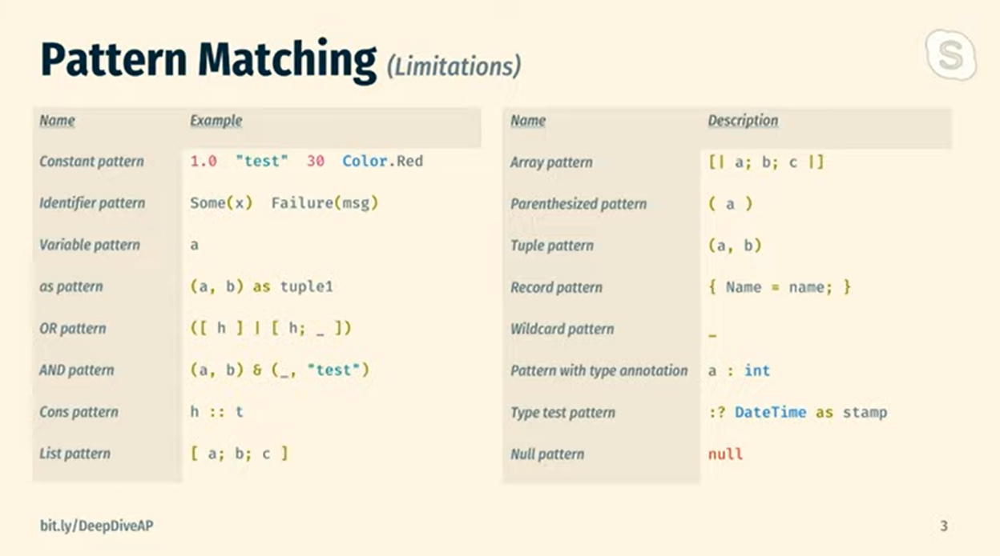

# Day 18: Pattern Matching (part 3)

The first two parts of pattern matching we touched on a number of different patterns, so to help remind you of what they are and what the syntax is you may find this slide from [Paul Blasucci's](https://twitter.com/pblasucci) F# Online talk on [A Deep Dive into Active Patterns *](https://www.youtube.com/watch?v=Q5KO-UDx5eA) a useful reference:

 _* Don't watch this video yet, keep it in your back pocket once you have learned and used active patterns a little, at that point you may find it interesting to see how others might be using them._



We covered a number of these patterns already, some we haven't. Feel free to google and explore any that I've not explained, hopefully they are fairly self explanatory though.

I mentioned Active Patterns above, which may have you thinking what are Active Patterns? It's a feature that I thought was cool when first learning about it, but didn't quite understand where it would be useful. My mind has since been changed, and I realise how useful it is. Let's take a look at Active Patterns and what problem they help to solve.

Active Patterns are functions that give you the ability to encapsulate some pattern matching logic inside it's own function, and use that function when pattern matching.

That is an important thing to remember as we look at the below, it that an active pattern is a function. There are four types of Active Patterns, here are their names and their functional signature, as taken from Paul's talk:

```
Single-case - 'T -> 'A
Multiple-case - 'T -> Choice<'A, 'B, ... N'>
Single-case partial - 'T -> Option<'A>
Parameterised partial - 'T -> P1 -> ... -> Option<'A>
```

There is a new type above you've not seen before, but I imagine you can work out what it does. A Choice type is similar to a discriminated union. Out of X number of types, the value returned can only be one of those types. I won't dwell on this, if you relate it to the way a discriminated union works then you should be fine.

Let's break down each type of Active Pattern, what it does and where it can be useful.

Single-case active pattern is essentially a map function. It's useful when you have a type that can always be converted to another.

The signature as you just saw is: ```'T -> 'A```

Let's write a useless implementation of a function to help explain the usage:

```fsharp
let (|NumberAsString|) (input : int) = input.ToString()
let outcome =
    match 2 with
    | NumberAsString str -> str
printf "%s" outcome
```
[Try the code](https://try.fsharp.org/#?code=LAKANgpgLgBAFAHwHIFcC2AjCAnAggZwGUpsBLAOwHMEBKeCgBxVgC4YKo6Bed8pqAHQAVAPbEyVODVChIsEcwDGItBBhdQMLTDQBDKIoAWMAEwwA7qSiHN2hDFSYcBcRUox8JGAFoAfB5IZEAYJKAAzGAAiAFJ8SJgFAxUIIA&html=DwCwLgtgNgfAsAKAAQqaApgQwCb2ag4CdMTJcMABwFp0BHAVwEsA3AXgCIBhAewDsw6AdQAqAT0roOSAMb9BAzoIAeYAPThoAbhkhMAJwDOJNgzAAzagA4OeQhqy5EhAEY9sYu6mBq3HvD6asEA&css=Q)

You'll notice that in our pattern matching we only need to provide one case, the F# compiler knows that there are no other alternatives to be handled.

The above is fairly over the top considering we are matching on a single outcome, in this case we could speed things up by doing some inline pattern matching in the function

```fsharp
let printAsString (NumberAsString str) = printf "%s" str
printAsString 1 // Notice how it still expects an int
```
[Try the code](https://try.fsharp.org/#?code=LAKANgpgLgBAFAHwHIFcC2AjCAnAggZwGUpsBLAOwHMEBKeCgBxVgC4YKo6Bed8pqAHQAVAPbEyVODVChIsBhKgFxFSvFSYcykqpj4S3GAo4AzGACIApPnN6SMkMfJKiOqjACMQA&html=DwCwLgtgNgfAsAKAAQqaApgQwCb2ag4CdMTJcMABwFp0BHAVwEsA3AXgCIBhAewDsw6AdQAqAT0roOSAMb9BAzoIAeYAPThoAbhkhMAJwDOJNgzAAzagA4OeQhqy5EhAEY9sYu6mBq3HvD6asEA&css=Q)

As you can see the printAsString input still expects an integer, the inline pattern matching helps us to avoid the need to do pattern matching lower down in the function call.

If we wanted access to both the original value and the pattern matched value, we can wrap that inline pattern matching with "as [variableName]" and get access to both:

```fsharp
let printWithBoth ((NumberAsString str) as number) =
    printf "Original value %d and the matched value: %s" number str
printWithBoth 1
```
[Try the code](https://try.fsharp.org/#?code=LAKANgpgLgBAFAHwHIFcC2AjCAnAggZwGUpsBLAOwHMEBKeCgBxVgC4YKo6Bed8pqAHQAVAPbEyVODVChIsBhKgB1UlAAWAIRHr4cVJhwFxFSjHwk6AQ3wxy6LNm6gYLmAo4AzGACIA8mUoKSzAYADdglAgYAFIAExhLcnj1KLRLKABjNQh48LBItmj8b1t7HDMSGRB3cmVVTW01GABGIA&html=DwCwLgtgNgfAsAKAAQqaApgQwCb2ag4CdMTJcMABwFp0BHAVwEsA3AXgCIBhAewDsw6AdQAqAT0roOSAMb9BAzoIAeYAPThoAbhkhMAJwDOJNgzAAzagA4OeQhqy5EhAEY9sYu6mBq3HvD6asEA&css=Q)

The above is obviously a pointless implementation, I wish I could give a more useful example than the above but I'm at a loss right now. Personally I've not used a Single-case pattern in any of my F# yet, one day soon I'm sure it will come.

You can think of it as very similar to a Single Case Union, as there is only one outcome available to you.